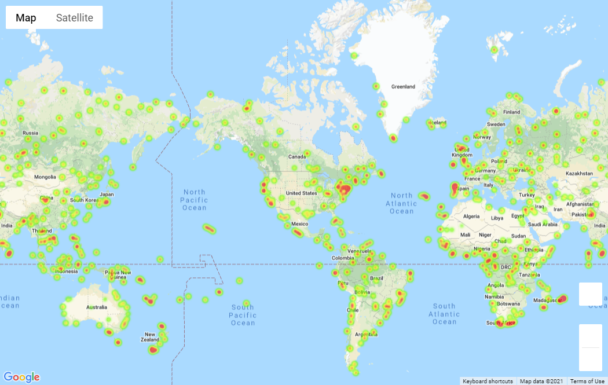
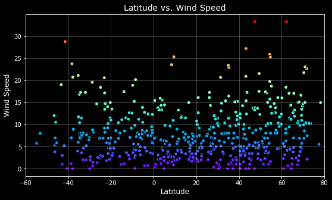
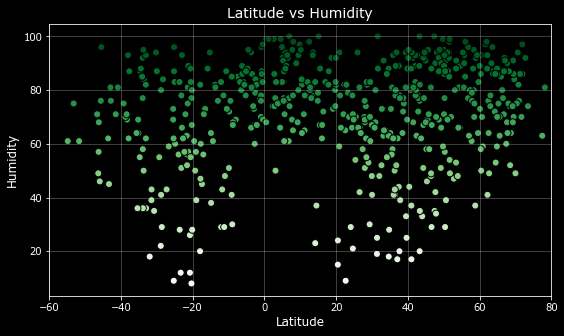
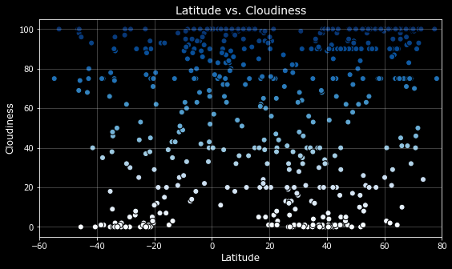

# Python API Challenege

For this project given a dataset of cities we were tasked to grab the cities closest to our randomly generated Latitude and Longitude coordinates. We then proceed to preform a check on the weather conditions of each city using a series of successive API calls. The API used for the weather portion was Open Weather Maps. I obtained the data for a total of 546 cities. A pandas data frame was created from the 546 cities and their respected weather data factors. Max Temperature, Humidity, Cloudiness and Wind Speed are the weather conditions used in our analysis. After our dataset was assembled Matplotlib was then used to create various plots to visualize what our dataset was telling us.

## Map Images 
---
### Map One

### Map Two

## Plot Images
---
### Latitude vs Max Temperature

### Latitude vs Wind Speed

### Latitude vs Humidity

### Latitude vs Cloud

